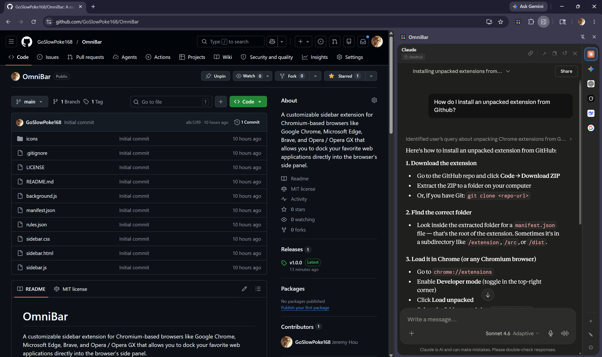

# OmniBar

A customizable sidebar extension for Chromium-based browsers like Google Chrome, Microsoft Edge, Brave, and Opera / Opera GX that allows you to dock your favorite web applications directly into the browser's side panel. 

Created as a replacement for the Microsoft Edge sidebar since Microsoft removed it for no reason...

## Features

- **Customizable App Dock:** Add, edit, remove, and reorder your favorite web apps via a sleek, drag-and-drop interface.
- **Global Toggle Shortcut:** Quickly open and close the sidebar using a customizable keyboard shortcut (default: `Alt+Z`).
- **Contextual Copy Utilities:** Includes a one-click header utility to instantly copy the active tab's URL to your clipboard for easy pasting into docked AI tools.
- **Saved Preferences:** Your custom list of web apps is automatically saved to local storage, ensuring your custom setup remains intact even after restarting the browser.

## How to Use

- Click an icon to open it in the sidebar
- Right-click an icon to edit, remove, or open elsewhere
- Click ✎ to enter edit mode & drag to reorder
- Click + to add a new app

## Compatibility

| Browser | Support Status |
| :--- | :--- |
| **Google Chrome** |  |
| **Microsoft Edge** |  |
| **Brave** |  |
| **Opera / Opera GX** |  |
| **Mozilla Firefox** |  |

*Note: This extension relies on the Manifest V3 `sidePanel` API. Browsers lacking support for this specific API (like Mozilla Firefox) cannot run the extension currently, though Firefox support is planned for the future.*

## Installation

This extension is intended to be loaded as an unpacked extension in Developer Mode for now. In the future, there are plans to publish it to the browser extension stores.

### General Steps

1. **Download the code:** Download the latest release `.zip` file from the Releases page (or clone the repository) and extract it to a folder on your computer.
2. Open your browser and navigate to the Extensions page (see the [Browser-Specific Links](#browser-specific-links) below).
3. Enable **Developer mode**.
4. Click the **Load unpacked** button.
5. Select the extracted folder containing this extension's source code.
6. (Optional) Configure the keyboard shortcut by navigating to the Shortcuts page.

### Browser-Specific Links

| Browser | Extensions Page | Shortcuts Page |
| :--- | :--- | :--- |
| **Google Chrome** | `chrome://extensions/` | `chrome://extensions/shortcuts` |
| **Microsoft Edge** | `edge://extensions/` | `edge://extensions/shortcuts` |
| **Brave** | `brave://extensions/` | `brave://extensions/shortcuts` |
| **Opera / Opera GX** | `opera://extensions/` | `opera://extensions/shortcuts` |

## Technical Notes

To allow external websites to load inside the sidebar's `<iframe>` context, this extension utilizes the `declarativeNetRequest` API to modify HTTP response headers. However, some websites might not connect and load due to client-side bot-mitigation techniques (such as Cloudflare Turnstile), which block rendering within an iframe.

## TODO

- [ ] Add a page button to extract context from the current page

## Support the Project
If you find this plugin useful, please leave a star on GitHub or consider supporting its development!

## License

This project is licensed under the MIT License. See the [LICENSE](LICENSE) file for details.

